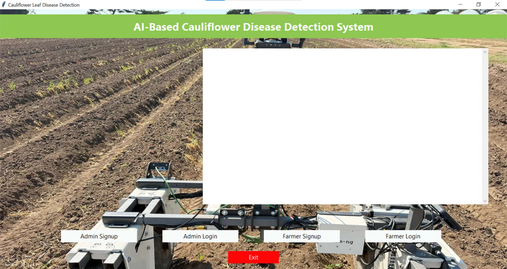
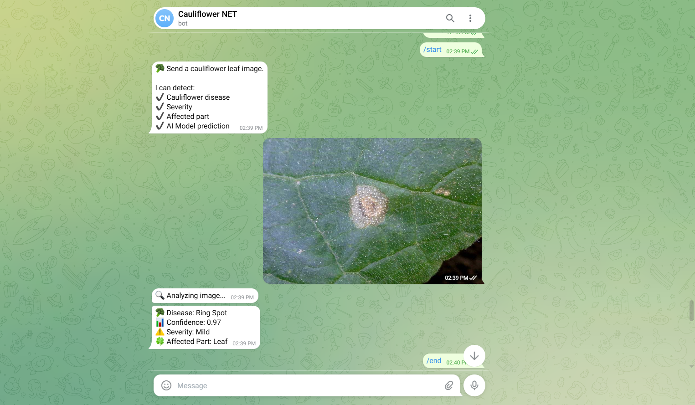

# 🥦 LeafGuardAI – AI-Based Cauliflower Disease Detection System

> 📌 Final Year Project
> 🎤 Presented at ICETETAMS 2026
> 📄 Research published in JSETMS

LeafGuardAI is an AI-powered desktop application developed to help identify cauliflower diseases from plant images using Machine Learning and Deep Learning techniques. The system predicts the disease, provides a confidence score, and generates AI-powered explanations to assist users in understanding the prediction.

The application also integrates secure authentication, prediction history management, and Telegram Bot support to provide a practical and user-friendly crop disease diagnosis system.

---

## ✨ Key Features

* 🌱 Automated cauliflower disease detection from uploaded images
* 🧠 Multi-model evaluation using Logistic Regression, ANN, Decision Tree, and a Hybrid InceptionResNet-LRC model
* 🤖 Explainable AI (XAI) powered by Gemini API for disease insights and crop recommendations
* 💬 Telegram Bot integration for remote image-based prediction
* 📊 Prediction confidence scoring
* 🔐 Secure farmer/admin authentication using bcrypt password hashing
* 🗄️ MySQL database integration for storing prediction history
* 🖥️ Desktop application built using Tkinter
* 📂 Batch image prediction support

---

## 🛠️ Tech Stack

| Category         | Technologies                     |
| ---------------- | -------------------------------- |
| Programming      | Python                           |
| Machine Learning | TensorFlow, Scikit-learn, OpenCV |
| Data Processing  | NumPy, Pandas                    |
| Desktop GUI      | Tkinter                          |
| Database         | MySQL                            |
| AI Services      | Gemini API                       |
| Version Control  | Git, GitHub                      |

---

## 🔄 System Workflow

```text
User Login / Signup
        ↓
    Upload Image
        ↓
 Image Preprocessing
        ↓
 Disease Prediction
        ↓
 Confidence Score
        ↓
 Gemini AI Analysis
        ↓
 Prediction History
        ↓
 Telegram Bot Response (Optional)
```

---

## 📸 Application Screenshots

### 🔐 Login Page


### 🏠 Dashboard



### 🌱 Disease Prediction


### 🤖 Gemini AI Analysis


### 💬 Telegram Bot



---

## 📄 Research & Presentation

This project was:

* 🎤 Presented at the **International Conference on Emerging Trends in Engineering, Technology & Applied Management Sciences (ICETETAMS 2026)**.
* 📚 Associated with research published in the **Journal of Science Engineering Technology and Management Science (JSETMS)**.

---

## 🔮 Future Improvements

* Support additional crop diseases
* Cloud deployment for remote access
* Mobile application development
* Real-time field disease monitoring
* Multilingual support for farmers
