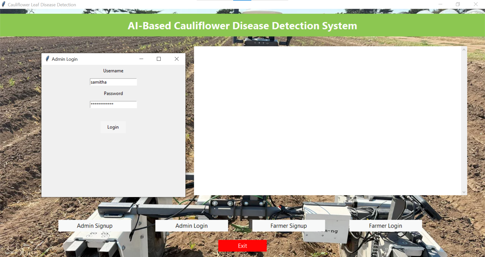
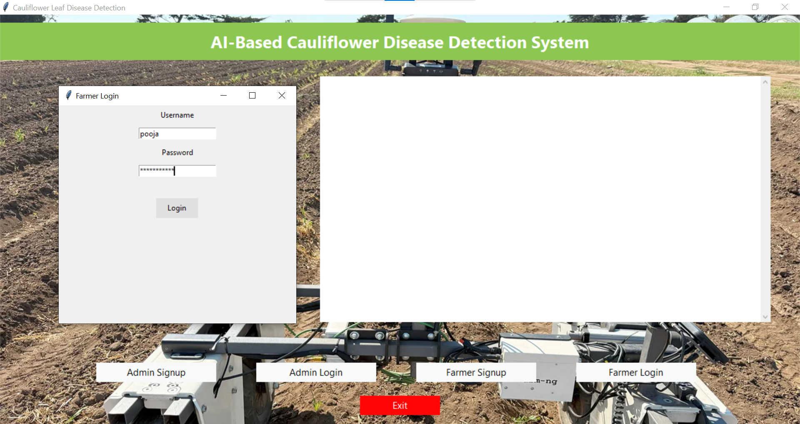
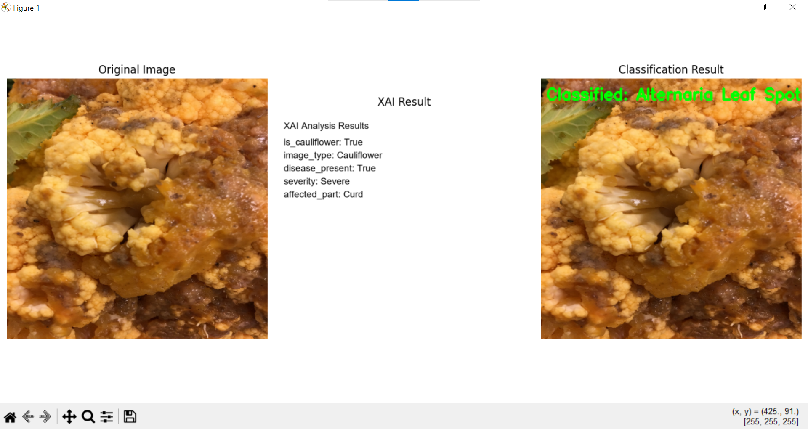
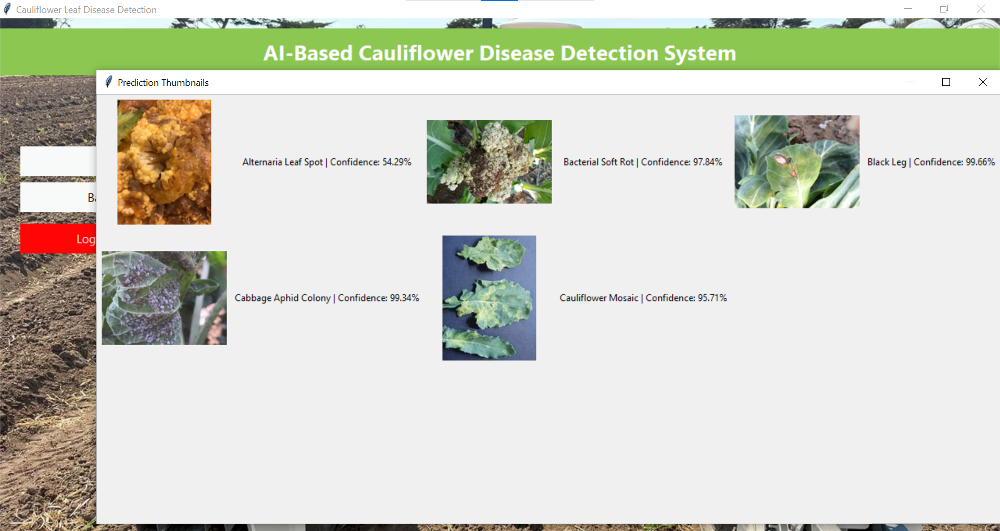
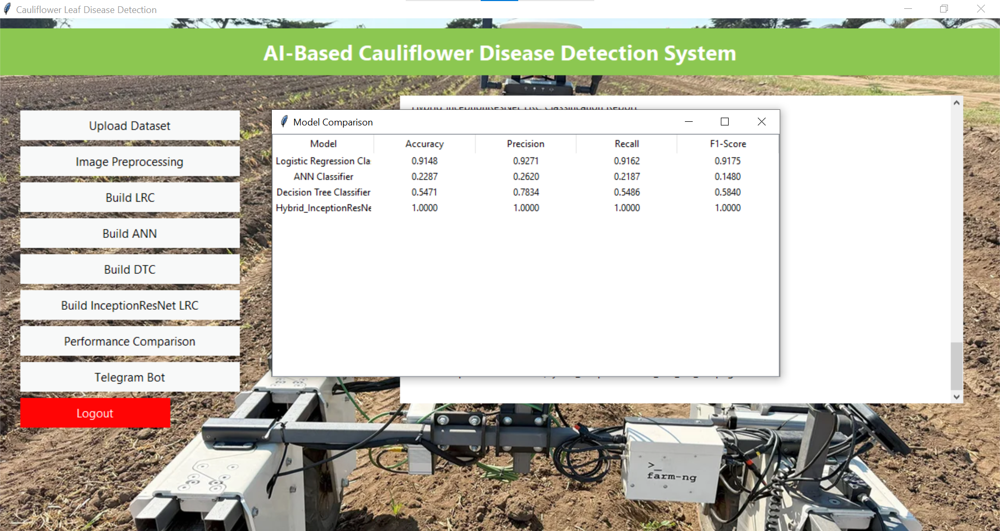
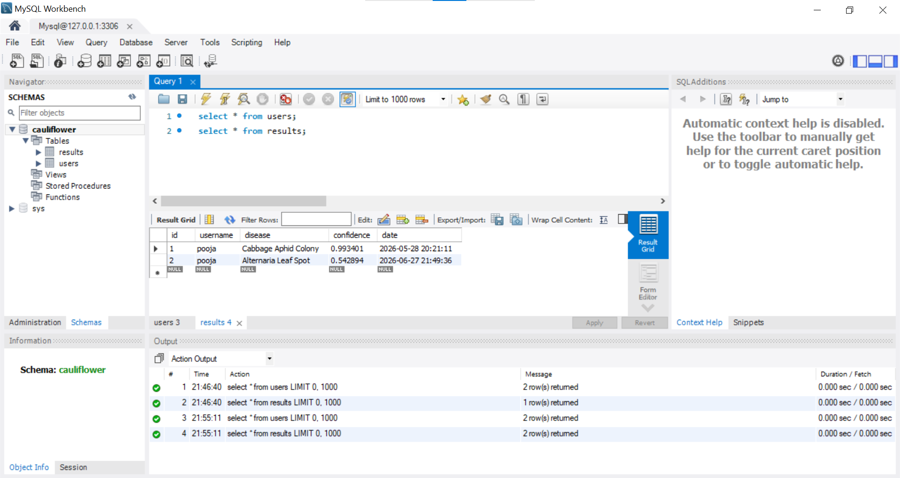

# 🥦 LeafGuardAI – AI-Powered Cauliflower Disease Detection System


> 📌 **Final Year Project**
> 🎤 **Presented at ICETETAMS 2026**
> 📄 **Research Published in JSETMS**

LeafGuardAI is an AI-powered desktop application developed to detect cauliflower leaf diseases using Machine Learning and Deep Learning techniques. The system analyzes uploaded leaf images, predicts the disease, provides confidence scores, and generates AI-powered explanations to help users better understand the diagnosis.

To make the solution practical for real-world agricultural use, the application integrates secure authentication, prediction history management, MySQL database support, Telegram Bot integration, and batch image prediction into a single intelligent crop disease diagnosis platform.

---

# ✨ Key Features

* 🌱 Automated cauliflower disease detection from uploaded leaf images
* 🧠 Multi-model implementation and evaluation using:
  * Logistic Regression
  * Artificial Neural Network (ANN)
  * Decision Tree
  * Hybrid InceptionResNet + Logistic Regression
* 🤖 Explainable AI (XAI) powered by Google Gemini API
* 💬 Telegram Bot integration for remote disease prediction
* 📊 Confidence score generation for every prediction
* 📦 Batch prediction support for multiple images
* 🔐 Secure Farmer/Admin authentication using bcrypt password hashing
* 🗄️ MySQL database integration for user management and prediction history
* 🖥️ Interactive desktop application developed using Tkinter

---

# 🛠️ Technology Stack

| Category             | Technologies      |
| -------------------- | ----------------- |
| Programming Language | Python            |
| Machine Learning     | Scikit-learn      |
| Deep Learning        | TensorFlow, Keras |
| Image Processing     | OpenCV            |
| Data Processing      | NumPy, Pandas     |
| Desktop GUI          | Tkinter           |
| Database             | MySQL             |
| Explainable AI       | Google Gemini API |
| Messaging Platform   | Telegram Bot API  |
| Version Control      | Git, GitHub       |

---

# 🔄 System Workflow

```text
                 Login
                   │
        ┌──────────┴──────────┐
        │                     │
        ▼                     ▼
  Admin Dashboard      Farmer Dashboard
        │                     │
        │              Upload Leaf Image(s)
        │                     │
        └──────────┬──────────┘
                   ▼
         Image Preprocessing
                   │
                   ▼
       AI Disease Prediction
                   │
                   ▼
     Confidence Score & Disease
                   │
                   ▼
      Gemini AI Explanation
                   │
                   ▼
     Store Prediction in MySQL
                   │
                   ▼
Telegram Bot Response (Optional)
```

---

# 🚀 Getting Started

## 1️⃣ Clone the Repository

```bash
git clone https://github.com/Samitha-Chowdari/AI-Based-CauliflowerDiseaseDetectionSystem.git
```

---

## 2️⃣ Navigate to the Project Directory

```bash
cd AI-Based-CauliflowerDiseaseDetectionSystem
```

---

## 3️⃣ Install Required Libraries

```bash
pip install -r requirements.txt
```

---

## 4️⃣ Configure Environment Variables

Create a `.env` file in the project root and add the following:

```env
GEMINI_API_KEY=your_api_key
TELEGRAM_BOT_TOKEN=your_bot_token

DB_HOST=localhost
DB_USER=root
DB_PASSWORD=your_password
DB_NAME=cauliflower
```

> Replace the placeholder values with your own API keys and database credentials.

---

## 5️⃣ Configure MySQL Database

Import and execute the provided `database.sql` file in MySQL Workbench to automatically create the required database and tables.

---

## 6️⃣ Run the Application

```bash
python Main.py
```

---

# 📂 Project Structure

```text
LeafGuardAI/
│
├── assets/                 # README screenshots
├── model/                  # Trained models
├── TestImages/             # Sample test images
├── results/                # Prediction outputs
├── Temp/                   # Temporary files
├── database.sql            # MySQL database file
├── Main.py                 # Main application
├── requirements.txt
├── README.md
├── .gitignore
└── .env
```

---

# 📸 Project Screenshots

## 🏠 Main Dashboard

Main interface providing separate access to Admin and Farmer modules.


---

## 🔐 Admin Login

Administrator authentication interface for managing training and system functionalities.



---

## 👨‍🌾 Farmer Login

Farmer authentication interface for accessing prediction services.



---

## 🌿 Disease Prediction with Explainable AI

Displays predicted disease, confidence score, and AI-generated explanation.



---

## 📦 Batch Prediction

Allows multiple leaf images to be analyzed simultaneously.



---

## 🤖 Telegram Bot Integration

Users can upload leaf images through Telegram and receive instant disease predictions along with AI-generated explanations.


---

## 📊 Model Performance Comparison

Comparison of Machine Learning and Deep Learning models implemented in the project.



---

## 🗄️ User Authentication Database

Stores registered users and role information.


---

## 📈 Prediction History Database

Stores username, predicted disease, confidence score, and prediction timestamp.



---

# 🤖 Models Implemented

| Model                                        | Purpose                         |
| -------------------------------------------- | ------------------------------- |
| Logistic Regression                          | Machine Learning Classification |
| Artificial Neural Network (ANN)              | Deep Learning Classification    |
| Decision Tree                                | Machine Learning Classification |
| Hybrid InceptionResNet + Logistic Regression | Proposed Hybrid Model           |

The proposed Hybrid InceptionResNet + Logistic Regression model combines deep feature extraction with classical machine learning to improve disease classification performance.

---

# 📄 Research Contribution

This project was presented at the **International Conference on Emerging Trends in Engineering, Technology and Applied Management Sciences (ICETETAMS 2026)** and is associated with research published in the **Journal of Science Engineering Technology and Management Science (JSETMS).**

---

# 🔮 Future Improvements

* Support additional crop diseases
* Deploy as a cloud-based web application
* Develop Android and iOS mobile applications
* Real-time disease monitoring using IoT devices
* Multilingual support for farmers
* Improved Explainable AI visualizations
* Deploy as a web application using Django or Flask